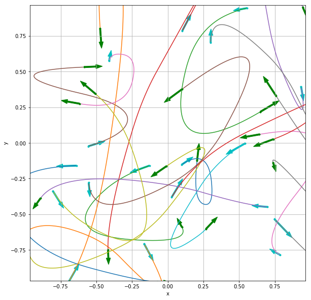

# double_integrator
This code contains implementations of the following optimal control problems for a double integrator system:
* [Time optimal control](report/time_optimal_control_double_integrator.pdf)
* Energy optimal control
* Fuel optimal control

Check [notebooks/run_double_integrator.ipynb](notebooks/run_double_integrator.ipynb) and [notebooks/run_double_integrator2d.ipynb](notebooks/run_double_integrator2d.ipynb) to get started.

 
